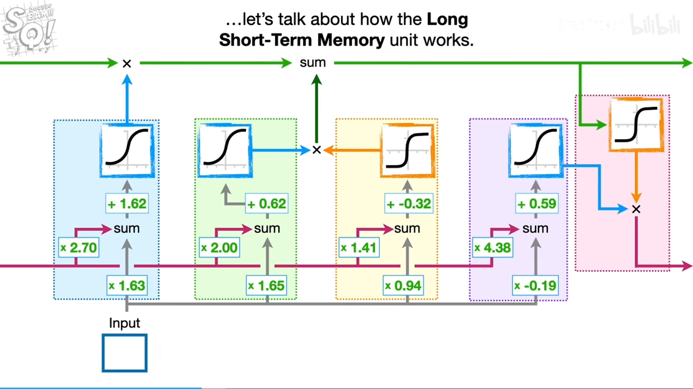

# LSTM

- 绿色的线：称为细胞状态，代表长期记忆，在上图中，长期记忆没有weights和bias可以直接修改
- 粉色的线：称为隐藏状态，代表短期记忆
- 蓝色框单元：确定了**要记住的长期记忆的百分比**
- 黄色框单元：将短期记忆和输入结合创造**潜在的长期记忆**
- 绿色框单元：确定**将潜在的长期记忆的多少百分比**加入到长期记忆中
- 输入门：由短期记忆(粉红线)、Input(灰线)输入结合黄、绿色框单元构成
- 粉色框单元：从长期记忆的输入经过tanh函数生成**潜在的短期记忆**
- 紫色框单元：计算要**记住的潜在短期记忆的百分比**
- Input：输入是一个多维的向量，即通过词嵌入编码后的向量

**最后的输出需要经过线性投射到目标空间（词汇表大小的向量），即最后输出的是隐藏状态维度，隐状态不一定要和目标空间一样大**

<u>细胞状态和隐藏状态的维度一般相同，而输入状态可以不同，只需通过连接层学习转换维度即可，即各个权重</u>

**对于多层LSTM，除了第一层的LSTM，每一层的LSTM都是由上一层的输出作为输入，这在seq2seq模型图中可以看出**

