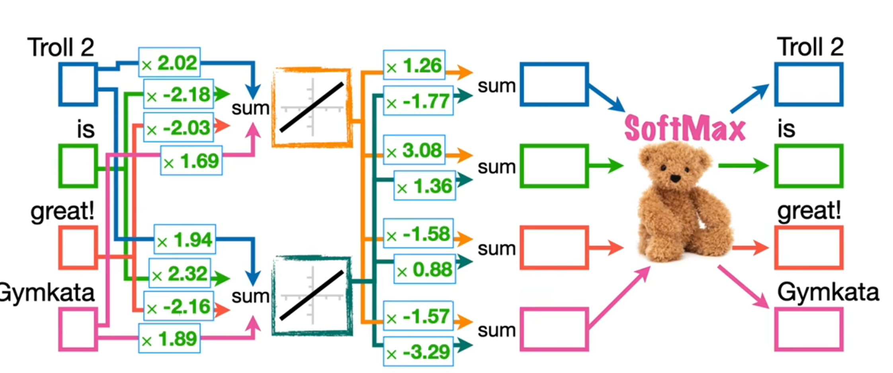

# 关于WordEmbedding的理解

这是词嵌入的输入原理



**输入输出采用one-hot编码，如上图的四个单词，采用四维的向量表示，label也用四维向量表示**

**label中的值表示每个词对应的下一个词是什么，同样也是one-hot编码**

<u>**如上图所表示的，输入的权重对应的就是4x2的词嵌入矩阵，也可以用全连接层来表示**</u>
\
\
\
\
\
关于词嵌入的one-hot问题，如果输入词汇量很大的情况下，即输入向量将会相当大，所以可以采用索引的方式

## 概念上的表示
**假设你的词汇表中有 5 个词，每个词可以用一个 one-hot 向量表示，如下：**


- **"apple" → [1, 0, 0, 0, 0]**
- **"banana" → [0, 1, 0, 0, 0]**
- **"cat" → [0, 0, 1, 0, 0]**
- **"dog" → [0, 0, 0, 1, 0]**
- **"elephant" → [0, 0, 0, 0, 1]**\
在这种表示中，每个词都对应着一个 5 维向量，其中只有一个位置为 1。

## 词嵌入矩阵
**现在，我们有一个词嵌入矩阵，假设嵌入维度为 3，这个矩阵的形状是 (5, 3)，例如：**\
$$W=\begin{bmatrix}
{w_{00}}&{w_{01}}&{w_{02}}\\
{w_{10}}&{w_{11}}&{w_{12}}\\
{w_{20}}&{w_{21}}&{w_{22}}\\
{w_{30}}&{w_{31}}&{w_{32}}\\
{w_{40}}&{w_{41}}&{w_{42}}
\end{bmatrix}$$
**每一行代表一个词的嵌入向量。比如第一行对应 "apple" 的嵌入向量。**

## one-hot 向量与嵌入矩阵相乘
**如果你用 one-hot 表示 "cat"，它的 one-hot 向量是 [0, 0, 1, 0, 0]。计算过程是：**
$$\begin{bmatrix}0,0,1,0,0
\end{bmatrix}\times W=\begin{bmatrix}{w_{20},{w_{21},{w_{22}}}}\end{bmatrix}
$$
**因为只有第三个元素为 1，所以结果正好取出了嵌入矩阵的第三行。**

## 为什么不用实际构造 one-hot 向量
虽然**概念上**可以把词看作 one-hot 向量再乘以矩阵，但实际上：\
- **效率问题**：one-hot 向量维度很高（词汇表可能有上万个词），构造和存储这些稀疏向量既耗内存又不高效。
- **直接查找**：我们可以直接用词在词汇表中的索引来查找对应的嵌入向量。例如，如果 "cat" 的索引是 2，就直接取嵌入矩阵的第 3 行（索引从 0 开始）。这就是所谓的“embedding lookup”。

## 具体操作示例
假设我们有如下词汇表和嵌入层：
```aiignore
import torch
import torch.nn as nn

# 假设词汇表大小为5，嵌入维度为3
vocab = {"apple": 0, "banana": 1, "cat": 2, "dog": 3, "elephant": 4}
embedding = nn.Embedding(num_embeddings=5, embedding_dim=3)

# 假设我们要获取 "cat" 的嵌入向量
# "cat" 的索引是 2
word_index = torch.tensor([vocab["cat"]])  # tensor([2])
embedded_vector = embedding(word_index)  # 直接查找第2号索引对应的向量

print("嵌入向量：", embedded_vector)
```
在这段代码中：
- 我们没有生成一个 [0, 0, 1, 0, 0] 的 one-hot 向量，而是直接用整数 2 代表 "cat"。
- `nn.Embedding` 会根据这个索引直接返回嵌入矩阵中对应的那一行。

## 总结
- **理论上**：每个词可以看作一个 one-hot 向量，然后与嵌入矩阵相乘得到低维嵌入向量。
- **实际中**：为了节省计算资源，我们直接使用词的索引，然后在嵌入矩阵中查找对应行，这个过程称为 embedding lookup。
- **嵌入向量**：就是嵌入矩阵中每一行的低维、密集表示，它们通过训练能够捕捉词之间的语义关系。

